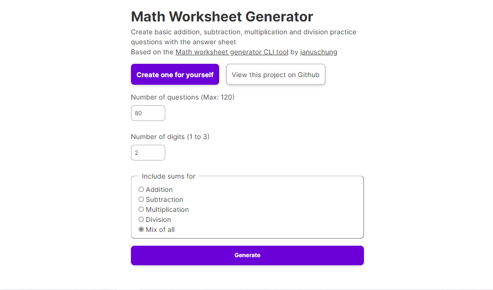
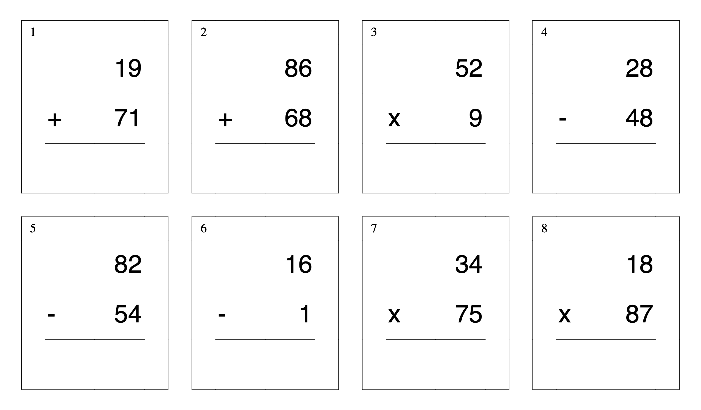
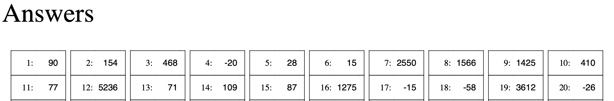

# Math Worksheet Generator (Web Version)

## Website screenshot

## Website URL
https://mathsworksheetgenerator.vercel.app

## Worksheet screenshots

## Background
[januschung](https://github.com/januschung/) made a [math worksheet generator](https://github.com/januschung/math-worksheet-generator) that was a python CLI tool.

I decided that it would be a good idea to make a web version of the tool

So I [took his permission](https://github.com/januschung/math-worksheet-generator/issues/39) made one using [Django](https://djangoproject.com) 

## Benefit of the Math Worksheet Generator
With the Math Worksheet Generator, you can create a PDF with unique questions, as needed, in a fraction of second.

There are five choices:
1. Addition
2. Subtraction
3. Multiplication
4. Division
5. Mixed

## How to run the Django project
1. Install all dependencies with `pip install -r requirements.txt`
2. Goto `web` directory and run `python manage.py runserver`

## How to Use
1. Go to https://mathsworksheetgenerator.herokuapp.com
2. Select number of questions you want to generate (max 1200), number of digits you want all the sums to have (1 to 3) and finally what type of questions you would like

Choose from:
- Addition
- Subtraction
- Multiplication
- Division
- Mix of all

Click Generate and you will instantly get a PDF downloaded to your downloads folder

## Sample
[sample worksheet](sample-worksheet.pdf)

## Code Overview
Everything for the CLI written in python in `run.py`. You can play with the font and grid size with the variables under the `# Basic settings` section.

The website is located in `web` folder as a Django project. The project settings and main project urls are located in `web/config/settings.py` and `web/config/urls.py`

The Django App that generates the worksheets is in`web/worksheetmaker`

## Contributing
I appreciate all suggestions or PRs which will help kids learn math better. Feel free to fork the project and create a pull request with your idea.

## TODO
Keep the website up to date with newer versions of [januschung's](https://github.com/januschung/)  [math worksheet generator](https://github.com/januschung/math-worksheet-generator)
